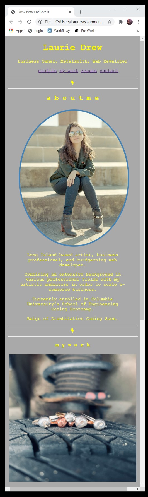

# Developer-Website
Portfolio of Web Development Work

Welcome! 

You have found yourself at a very exciting point in my development as a developer by being privy to my very first portfolio website!

As I am a baby-developer myself, you'll find this space rather wanting in deployed projects. Fear not, I built it and they will come...eventually. 

For the time being, feel free to evalute my skills based on my codding and styling of this page using html, css, js, and Drew grit. (I hope you like name-based puns and word play, there's no turning back now.) 

Rather than bore the visitor to death with another regurgitation of Lorem Ipsum boilerplate, I've supplemented the profile with various outside projects and credentials, substituting for my future showcase of deployed projects. That is, in case the visitor should have any doubts of my commitment to hard work and long-term projects, they may peruse those that are already well underway. 

This profile page is semantically organized, accessible, target-styled, with some personal touches thrown in to demonstrate personality and sensibilty to potential employers. While a mastery of the course work is essential for potential employers to gauge my competence, they also need to be able to determine if I am a personality they would want on their team as well. Synergy!

My favotie aspect of this portfolio is that it's also highly responsive. Blow it up, shrink it down, the page will move with you so there's no threat of vertigo while you scroll. 

Here is a final snapshot of the homescreen before deployment, adjusted to a very skinny window to demonstrate the responsiveness of the code:

 

Here is the deployed website URL:

 

Thank you for visiting, don't be a stranger!

Copyright (c) [2021] [Columbia School of Engineering]

Permission is hereby granted, free of charge, to any person obtaining a copy
of this software and associated documentation files (the "Software"), to deal
in the Software without restriction, including without limitation the rights
to use, copy, modify, merge, publish, distribute, sublicense, and/or sell
copies of the Software, and to permit persons to whom the Software is
furnished to do so, subject to the following conditions:

The above copyright notice and this permission notice shall be included in all
copies or substantial portions of the Software.

THE SOFTWARE IS PROVIDED "AS IS", WITHOUT WARRANTY OF ANY KIND, EXPRESS OR
IMPLIED, INCLUDING BUT NOT LIMITED TO THE WARRANTIES OF MERCHANTABILITY,
FITNESS FOR A PARTICULAR PURPOSE AND NONINFRINGEMENT. IN NO EVENT SHALL THE
AUTHORS OR COPYRIGHT HOLDERS BE LIABLE FOR ANY CLAIM, DAMAGES OR OTHER
LIABILITY, WHETHER IN AN ACTION OF CONTRACT, TORT OR OTHERWISE, ARISING FROM,
OUT OF OR IN CONNECTION WITH THE SOFTWARE OR THE USE OR OTHER DEALINGS IN THE
SOFTWARE.